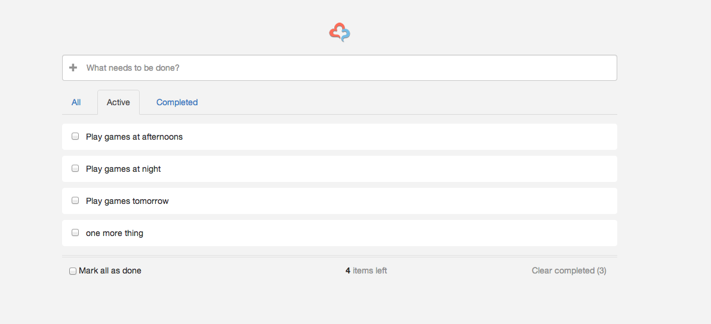

# todo
Simple todo App built with AngularJS, ExpressJS, and MongoDB



## Prerequisits
- [Node.js and NPM](http://nodejs.org/)
- [MongoDB](http://www.mongodb.org/)
- [Ruby](https://www.ruby-lang.org/), [Sass](http://sass-lang.com/) and [Compass](http://compass-style.org/)
- [CoffeeScript](http://coffeescript.org/)
- [Yeoman](http://yeoman.io/) ( Including Yo, [Bower](http://bower.io/), [Grunt](http://gruntjs.com/) )

## Preprocessor
- Scss for CSS
- CoffeeScript for JS

## How to run it?
1 Enter project directory

```
$ cd App-todo
```

2 Install front-end packages with Bower

```
$ bower install
```
3 Install develop and back-end packages with NPM

```
$ npm install
```

4 Run mongoDB in new tab

```
$ mongod
```

5 Run App with Node

```
$ node app.js
```

6 You can run and develop with command in new tab
```
$ grunt server
```

## File structure

<pre>
todo/
├── client/                         ---> Front end
│   ├── fonts
│   ├── images
│   ├── scripts
│   ├── styles
│   ├── views
│   └── index.html
├── server/                         ---> Back end
│   ├──
│   └── 
├── docs                            
├── .bowerrc                        ---> Configure file of Bower
├── .gitignore
├── .jshintrc                       ---> Configure file of JSHint
├── app.js                          
├── bower.json                      ---> The JSON file of Twitter Bower
├── conf.js                         ---> The Config file of the project
├── Gruntfile.coffee                ---> The configure file of Grunt
├── package.json                    ---> The JSON file of Grunt
└── README.md                       ---> The file you are reading :)
</pre>

## Issues
- Things work unexpectly when having items with same name.
    - Can not check item with same name, only one of them is checked when refresh. 
    - When delete one of the item, the rest items that has the same name will be deleted as well.
